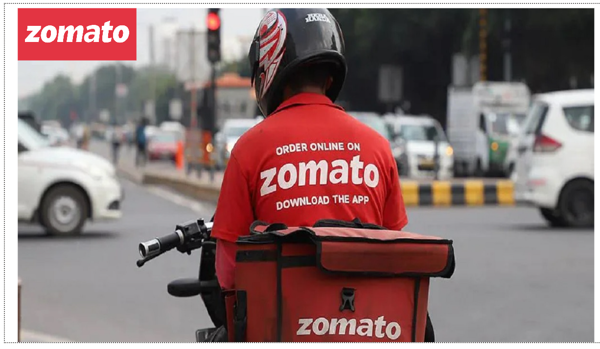
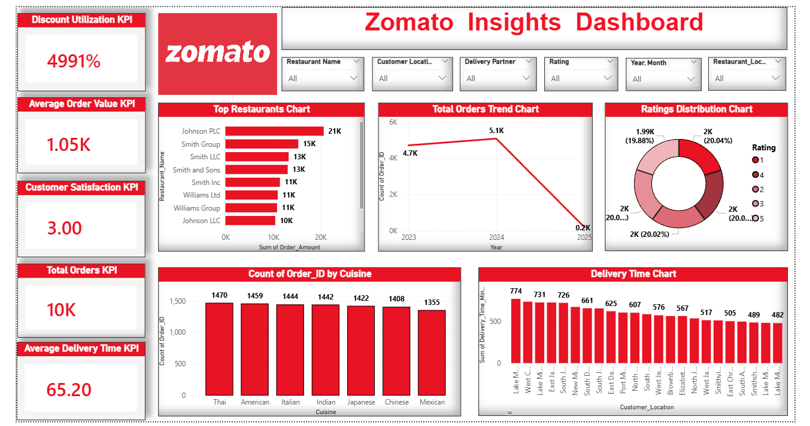

# Zomato-Insights-Dashboard
End-to-end Power BI dashboard showcasing KPIs, customer insights, and restaurant performance using interactive visualizations.
# 📊 Zomato Insights Dashboard (Power BI)

## 📌 Project Overview
This project is an interactive Power BI dashboard designed to analyze Zomato restaurant data. It provides insights into customer behavior, restaurant performance, and delivery trends.

## 🚀 Key Features
- 📈 KPI Tracking (Total Orders, Avg Order Value, Delivery Time, Customer Satisfaction)
- 🍽️ Top Restaurants & Cuisine Analysis
- ⭐ Ratings Distribution
- 📊 Year-wise Order Trends
- 🎯 Interactive Filters for dynamic exploration
- 🔄 Smooth navigation (Cover Page → Dashboard)

## 🛠️ Tools & Technologies
- Power BI  
- Data Cleaning  
- Data Visualization

## 💡 Insights Gained
- Identified top-performing restaurants  
- Analyzed customer preferences  
- Observed trends in orders and ratings

  ## 📸 Dashboard Preview

### Cover Page

### Live Dashboard

## 🎥 Project Demo
(https://www.linkedin.com/posts/praful-onkar_powerbi-dataanalytics-dashboarddesign-activity-7455525317152202752-LDoS?utm_source=share&utm_medium=member_desktop&rcm=ACoAAEgiqqUB64QvIzCHXwL1l6bQ-jw4rRaMgZg)

## 📬 Feedback
Feel free to share your feedback or suggestions!
